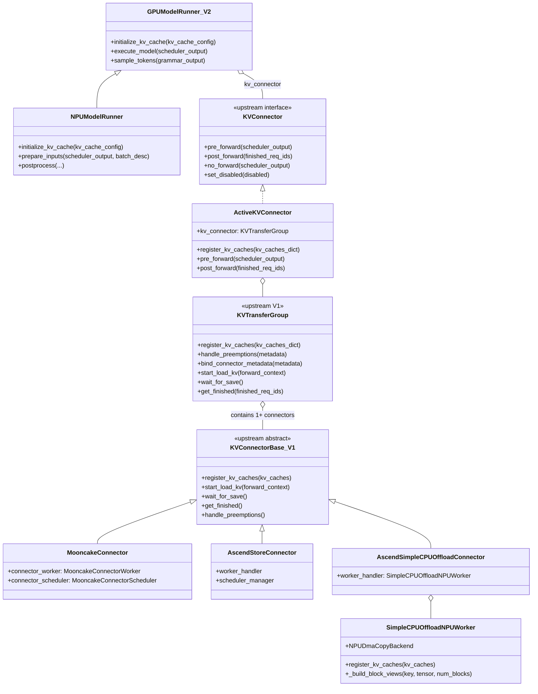
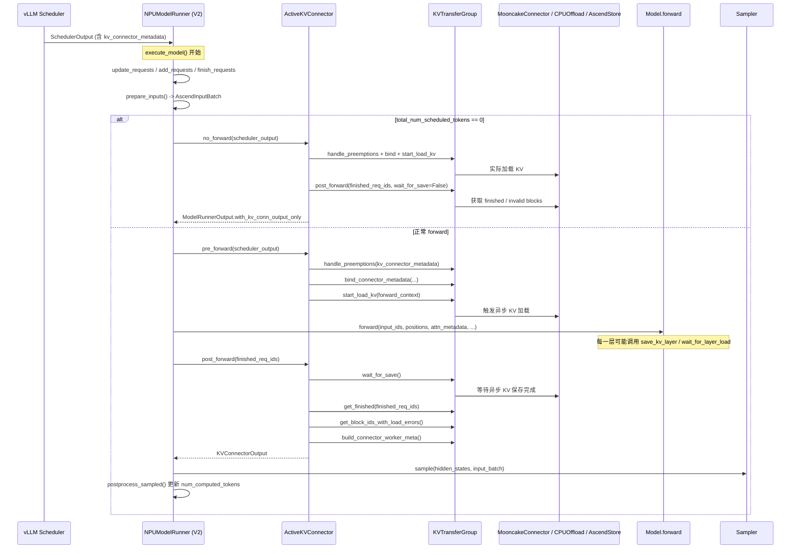

# KVConnector 与 MRV2 适配代码 Story 设计稿

> 目标读者：需要在 vLLM-Ascend 上维护/扩展 KVConnector，或理解 MRV2（Model Runner V2）对 KV 传输/卸载影响的开发者。
>
> 核心问题：MRV2 重构后，vLLM-Ascend 的 KVConnector 还需要在 model runner 里做适配吗？如果需要，改造点在哪里？

---

## 1. 故事背景：KVConnector 是做什么的

在大模型推理服务里，KV Cache 通常是最主要的显存占用来源。为了降低延迟、提高吞吐、支持长上下文，业界有几种典型的 KV Cache 管理/传输需求：

| 场景 | 说明 |
|------|------|
| **Disaggregated Prefill/Decode（PD 分离）** | Prefill 节点计算完 KV 后，把 KV 传输给 Decode 节点，避免重复计算。 |
| **CPU Offload** | 当 GPU 显存不足时，把暂时不用的 KV block 换入到 CPU 内存。 |
| **Remote KV Cache Pool** | 多实例共享一个 KV Cache 存储池（如 Mooncake、LMCache、AscendStore），实现 prefix caching 或跨请求复用。 |
| **Recompute Offload** | 把被抢占请求的 KV 临时 offload 到 CPU，恢复后再传回 GPU。 |

vLLM 把这些能力抽象成 **KVConnector**：

- **Scheduler 侧**：决定哪些 token 的 KV 可以从远端/CPU 加载，哪些需要本地重新计算。
- **Worker 侧**：在模型 forward 前后实际执行 KV 的 `send/recv/copy/save/load`。

Connector 本身与具体的 model runner 版本（V1/V2）理论上应该解耦，但不同 model runner 对 forward_context、async 调度、KV cache 张量布局的假设不同，所以还是需要理清接口边界。

---

## 2. 上游架构：V1 vs V2 的 KVConnector 接口

### 2.1 V1 路径：Model Runner 直接耦合 V1 Connector

在 V1 model runner（`vllm/v1/worker/gpu_model_runner.py`）中，KVConnector 的调用逻辑散落在 `execute_model` 和 `sample_tokens` 里，model runner 需要显式管理 pre_forward / post_forward 的时机。

关键方法：

| 方法 | 作用 | 在推理流程中的位置 |
|------|------|-------------------|
| `maybe_get_kv_connector_output` | 上下文管理器，包裹 forward 前后调用 `pre_forward` / `post_forward` | `execute_model` 进入 forward 前 |
| `kv_connector_no_forward` | 没有 token 要跑时（如纯 KV 加载步骤），单独触发 connector | `execute_model` 开头 token 数为 0 时 |
| `finalize_kv_connector` | 在投机解码后确保 KV save 完成 | `sample_tokens` 末尾 |

V1 的 connector 基类是 `KVConnectorBase_V1`，提供 scheduler/worker 两侧的一系列钩子。

### 2.2 V2 路径：Model Runner 通过 ActiveKVConnector 桥接 V1 Connector

MRV2 为了做到 modular + async-first，把 model runner 里大量的 KVConnector 调用细节抽到了 `vllm/v1/worker/gpu/kv_connector.py`。

```python
class KVConnector:
    def pre_forward(self, scheduler_output): ...
    def post_forward(self, finished_req_ids, wait_for_save=True): ...
    def no_forward(self, scheduler_output): ...
    def set_disabled(self, disabled): ...

class ActiveKVConnector(KVConnector):
    def __init__(self, vllm_config, kv_caches_dict):
        self.kv_connector = get_kv_transfer_group()  # 这就是 V1 的 KVTransferGroup
        self.kv_connector.register_kv_caches(kv_caches_dict)
        ...
```

V2 model runner 只认识 `KVConnector` 这个精简接口；`ActiveKVConnector` 负责把它翻译成 V1 connector 的 `handle_preemptions / bind_connector_metadata / start_load_kv / wait_for_save / get_finished` 等。

**这个设计的好处**：所有已有的 V1 connector 不需要重写，只要实现 V1 基类，就能被 MRV2 使用。

---

## 3. 整体类图



**说明**：

- `NPUModelRunner` 继承上游 `GPUModelRunner_V2`，**没有**重载 `KVConnector` 相关方法。
- `ActiveKVConnector` 是上游提供的 V1→V2 桥接层，vLLM-Ascend 直接使用。
- 真正的 NPU 适配发生在 `MooncakeConnector`、`AscendStoreConnector`、`SimpleCPUOffloadNPUWorker` 等 V1 connector 内部。

---

## 4. V2 下单步推理时序图（含 KVConnector）



**关键观察**：

- V2 把 `pre_forward` 放在 `model.forward` 之前，`post_forward` 放在 `model.forward` 之后，调用时机比 V1 更规整。
- Connector 内部可以异步执行加载/保存；`post_forward` 里的 `wait_for_save()` 是同步等待点。
- 当 `total_num_scheduled_tokens == 0` 时（例如 PD 分离中纯接收 KV 的 step），走 `no_forward` 分支。

---

## 5. 为什么 v2 model runner 本身不需要改造

### 5.1 NPUModelRunner 没有重载 KVConnector 相关方法

在 `vllm_ascend/worker/v2/model_runner.py` 中搜索 `kv_connector`：

```bash
rg 'kv_connector' vllm_ascend/worker/v2/model_runner.py
# 无匹配
```

`NPUModelRunner` 的 `execute_model` / `sample_tokens` 完全继承上游 `GPUModelRunner`（V2），自然复用了上游的 `ActiveKVConnector` 调用逻辑。

### 5.2 ActiveKVConnector 已经做了 V1→V2 翻译

上游 `vllm/v1/worker/gpu/kv_connector.py`：

```python
class ActiveKVConnector(KVConnector):
    def pre_forward(self, scheduler_output):
        self.kv_connector.handle_preemptions(...)
        self.kv_connector.bind_connector_metadata(...)
        self.kv_connector.start_load_kv(get_forward_context())

    def post_forward(self, finished_req_ids, wait_for_save=True):
        self.kv_connector.wait_for_save()
        output.finished_sending, output.finished_recving = self.kv_connector.get_finished(...)
        output.invalid_block_ids = self.kv_connector.get_block_ids_with_load_errors()
        ...
```

这意味着：**只要 vLLM-Ascend 的 connector 实现了 V1 基类 `KVConnectorBase_V1`，它就能自动在 V2 model runner 下工作**。

### 5.3 vLLM-Ascend 的 connector 注册机制 unchanged

`vllm_ascend/distributed/kv_transfer/__init__.py` 在初始化时通过 `KVConnectorFactory` 注册 connector：

```python
def register_connector():
    KVConnectorFactory.register_connector("MultiConnector", ..., "AscendMultiConnector")
    KVConnectorFactory.register_connector("MooncakeConnectorV1", ..., "MooncakeConnector")
    KVConnectorFactory.register_connector("SimpleCPUOffloadConnector", ..., "AscendSimpleCPUOffloadConnector")
    ...
```

这个注册表被 `ensure_kv_transfer_initialized()` 使用，与 model runner 版本无关。

---

## 6. vLLM-Ascend 真正需要做的改造点

虽然 model runner 不需要改，但 **KV cache 的物理格式** 和 **拷贝算子** 必须适配 NPU。这些改造点分布在以下几处。

### 6.1 KV Cache 分配与形状：v2 路径的 patch

**文件**：`vllm_ascend/patch/worker/patch_v2/patch_attn_utils.py`

```python
vllm.v1.worker.gpu.attn_utils._allocate_kv_cache = _allocate_kv_cache
vllm.v1.worker.gpu.attn_utils._reshape_kv_cache = _reshape_kv_cache_v2
vllm.v1.worker.gpu.model_runner.get_kv_cache_spec = get_kv_cache_spec
```

**为什么需要改造**：

上游 V2 的 KV cache 分配是面向 CUDA 的连续/堆叠布局；Ascend 需要：

1. **K/V 分离**：`_allocate_kv_cache` 为每一层返回 `(k_cache, v_cache)` 两个独立 tensor，而不是一个 `[:, 0]` 和 `[:, 1]` 的堆叠 tensor。
2. **2 MiB 地址对齐**：prefill disaggregation 要求 K/V tensor 的起始地址按 2 MiB 对齐，所以先 over-allocate 再 slice。
3. **MLA 拆分**：DeepSeek MLA 的 nope cache 和 rope cache 要按 `kv_lora_rank` / `qk_rope_head_dim` 分开 reshape。

**对 KVConnector 的影响**：

`register_kv_caches(kv_caches_dict)` 收到的 dict 里，每个 value 可能是 `torch.Tensor` 或 `(k, v)` tuple。connector 必须能像 `SimpleCPUOffloadNPUWorker._flatten_kv_value()` 那样遍历子 tensor，否则会把 V cache 漏掉。

### 6.2 SimpleCPUOffload：替换 CUDA 拷贝后端

**文件**：

- `vllm_ascend/distributed/kv_transfer/kv_pool/simple_cpu_offload/simple_cpu_offload_connector.py`
- `vllm_ascend/simple_kv_offload/worker.py`
- `vllm_ascend/simple_kv_offload/copy_backend.py`
- `vllm_ascend/simple_kv_offload/npu_mem_ops.py`

**改造内容**：

1. `AscendSimpleCPUOffloadConnector.__init__` 中把父类创建的 CUDA worker handler 替换成 `SimpleCPUOffloadNPUWorker`。
2. `SimpleCPUOffloadNPUWorker.register_kv_caches`：
   - 遍历 K/V 子 tensor，按 `data_ptr()` 去重；
   - 用 tensor 自身 shape/stride 计算 block 大小（而不是 `storage.nbytes()`，因为 NPU 有 alignment padding）；
   - 分配 CPU pinned memory 做 mirror；
   - 用 `torch.npu.Stream` 做异步拷贝。
3. `NPUDmaCopyBackend` 用 `aclrtMemcpyBatchAsync` 批量搬移 KV block。

### 6.3 Mooncake / MooncakeLayerwise / AscendStore：NPU  Gather/Scatter 算子

**文件**：

- `vllm_ascend/distributed/kv_transfer/kv_p2p/mooncake_connector.py`
- `vllm_ascend/distributed/kv_transfer/kv_p2p/mooncake_layerwise_connector.py`
- `vllm_ascend/distributed/kv_transfer/kv_pool/ascend_store/ascend_store_connector.py`

**改造内容**：

- `register_kv_caches` 解析 `(k, v)` tuple 或独立 tensor，记录每层 base addr / block stride / block size scale。
- KV 实际收发使用 `torch_npu.npu_gather_pa_kv_cache` / `npu_scatter_pa_kv_cache`。
- `MooncakeConnectorWorker` 中的同步点用 `torch.npu.synchronize()` 替代 `torch.cuda.synchronize()`。

### 6.4 MultiConnector：聚合多种 connector

**文件**：`vllm_ascend/distributed/kv_transfer/ascend_multi_connector.py`

**改造内容**：

- 继承上游 `MultiConnector`，但 override `request_finished_all_groups` 以支持 HMA（Hybrid Memory Attention）场景下的多 KV cache group。
- 在 `update_state_after_alloc` 中对未被选中的 connector 传入 empty blocks，避免重复占用资源。

---

## 7. 代码修改点一览表

| 层级 | 文件 | 改动 | 是否 V2 特有 |
|------|------|------|-------------|
| **Model Runner** | `vllm_ascend/worker/v2/model_runner.py` | 无 KVConnector 相关改动 | - |
| **KV Cache 分配 Patch** | `vllm_ascend/patch/worker/patch_v2/patch_attn_utils.py` | 替换 `_allocate_kv_cache` / `_reshape_kv_cache` / `get_kv_cache_spec` | 是 |
| **KV Cache 分配实现** | `vllm_ascend/worker/v2/attn_utils.py` | 提供 NPU 版 K/V 分离分配、MLA reshape | 是 |
| **Connector 工厂注册** | `vllm_ascend/distributed/kv_transfer/__init__.py` | 注册 Ascend 版 Mooncake / SimpleCPUOffload / AscendStore / MultiConnector 等 | 否（V1/V2 通用） |
| **SimpleCPUOffload NPU Worker** | `vllm_ascend/simple_kv_offload/worker.py` | K/V 子 tensor 遍历、alignment 处理、NPU stream、aclrtMemcpyBatchAsync | 否（V1/V2 通用） |
| **SimpleCPUOffload Connector** | `vllm_ascend/distributed/kv_transfer/kv_pool/simple_cpu_offload/simple_cpu_offload_connector.py` | 替换 worker handler | 否 |
| **Mooncake Connector** | `vllm_ascend/distributed/kv_transfer/kv_p2p/mooncake_connector.py` | NPU gather/scatter、register_kv_caches 适配 K/V 分离 | 否 |
| **AscendStore Connector** | `vllm_ascend/distributed/kv_transfer/kv_pool/ascend_store/ascend_store_connector.py` | 同上 | 否 |
| **MultiConnector** | `vllm_ascend/distributed/kv_transfer/ascend_multi_connector.py` | HMA 多 group 支持 | 否 |

---

## 8. 关键方法功能速查

### 8.1 V2 Model Runner 侧（上游）

| 方法 | 所属类 | 功能 | 在流程中的作用 |
|------|--------|------|----------------|
| `initialize_kv_cache` | `GPUModelRunner` | 创建 KV cache、attention backend、block table、cudagraph manager | 同时调用 `get_kv_connector()` 创建 `ActiveKVConnector` |
| `execute_model` | `GPUModelRunner` | 处理请求状态、准备输入、跑模型、采样 | 在 forward 前后调用 `kv_connector.pre_forward/post_forward` |
| `sample_tokens` | `GPUModelRunner` | 采样、后处理、投机解码 | V2 中 KV connector 的 post_forward 已在 execute_model 中完成 |

### 8.2 ActiveKVConnector 侧（上游）

| 方法 | 功能 |
|------|------|
| `pre_forward` | 处理抢占、绑定 metadata、启动 KV 异步加载 |
| `post_forward` | 等待 KV 保存完成、获取 finished/invalid blocks、构建 worker meta |
| `no_forward` | 没有 token 要跑时，仅执行 KV 加载/保存并返回结果 |
| `set_disabled` | dummy run 期间禁用 connector，避免污染 KV 状态 |

### 8.3 V1 Connector 侧（vLLM-Ascend 实现）

| 方法 | 功能 |
|------|------|
| `register_kv_caches` | 接收 runner 分配好的 KV cache tensor，建立层到物理地址的映射 |
| `handle_preemptions` | 请求被抢占/驱逐前，把即将被覆盖的 KV block 保存走 |
| `start_load_kv` | 根据 scheduler 给的 metadata，启动远端/CPU KV 异步加载 |
| `wait_for_save` | 等待所有异步保存完成 |
| `get_finished` | 返回已完成 send/recv 的请求集合 |
| `save_kv_layer` | layerwise connector 每层 forward 后保存该层 KV |

---

## 9. 风险与 TODO

### 9.1 forward_context 时序

上游 `ActiveKVConnector.pre_forward` 中有 TODO：

```python
# TODO: sort out KV Connectors' use of forward_context
```

V2 中 `pre_forward` 调用时，如果 `execute_model` 还没进入 `set_forward_context` 包围的模型 forward，则 `get_forward_context()` 可能为 `None`，`ActiveKVConnector` 会创建一个 dummy forward context。依赖 `attn_metadata` 做加载的 connector（如 layerwise）需要验证这种情况下行为是否正确。

### 9.2 Async-first 与同步点

V2 要求 CPU/GPU 重叠。如果 connector 内部出现隐式同步（如 `tensor.item()`、`torch.npu.synchronize()`），会破坏 async scheduling。需要重点审计：

- `MooncakeConnectorWorker` 中的 `torch.npu.synchronize()`；
- `SimpleCPUOffloadNPUWorker` 中的事件等待逻辑；
- 任何从 GPU tensor 读值回 CPU 的代码。

### 9.3 V2 测试覆盖不足

`worker.py` 中有明确警告：

```python
logger.warning("npu model runner v2 is in developing, some features doesn't work for now.")
```

目前 `tests/e2e/` 下没有看到专门的 `use_v2_model_runner=1` + KVConnector 的组合测试。建议新增：

- SimpleCPUOffload + V2 的 UT/E2E；
- Mooncake PD 分离 + V2 的 E2E；
- 多 connector（MultiConnector）+ V2 的 E2E。

### 9.4 新增 connector 的 checklist

如果要在 vLLM-Ascend 上新增一种 KVConnector：

1. 实现 `KVConnectorBase_V1` 的 scheduler/worker 方法；
2. 在 `register_kv_caches` 中正确处理 NPU 的 K/V 分离 tensor；
3. 所有 GPU→CPU / CPU→GPU / NPU→NPU 拷贝使用 NPU 算子或 `torch.npu` stream；
4. 在 `vllm_ascend/distributed/kv_transfer/__init__.py` 中注册；
5. **不需要** 修改 `vllm_ascend/worker/v2/model_runner.py`。

---

## 10. 总结

- **MRV2 没有引入新的 KVConnector 抽象**，它通过 `ActiveKVConnector` 把 V1 connector 桥接到 V2 model runner。
- **vLLM-Ascend 的 model runner v2 不需要为 KVConnector 写额外代码**，`NPUModelRunner` 完全继承上游 `GPUModelRunner` 的 KVConnector 调用逻辑。
- **真正需要持续维护的改造点在 connector 内部和 KV cache 分配 patch**：
  - K/V 分离的 tensor 布局；
  - 2 MiB 对齐；
  - NPU 拷贝算子（aclrtMemcpyBatchAsync、npu_gather_pa_kv_cache 等）；
  - Async 调度下的同步点控制。
- **未来如果上游推出 KVConnectorBase_V2**，则可能需要为每个 connector 新增 V2 实现；当前版本（v1 基类 + ActiveKVConnector 桥接）下，connector 层可以复用。
